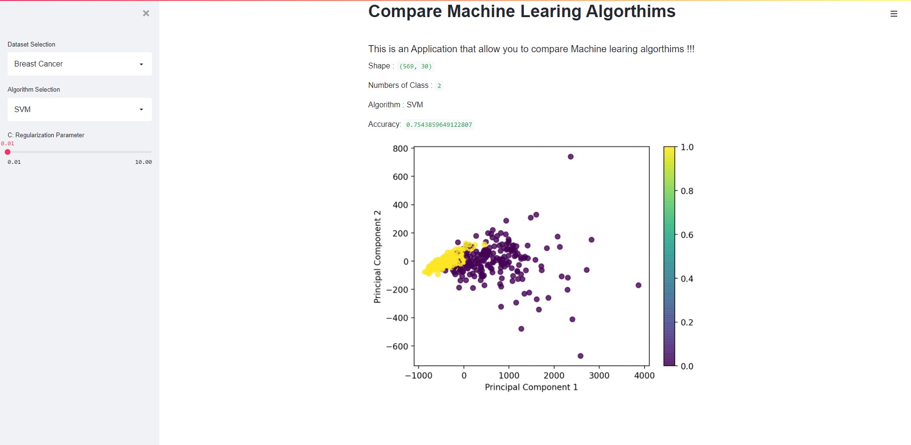

# MachineLearningCompare
A machine learning comparison application using streamlite framework 

## Currently Supported Machine Learning Algorithms  : 
*  Support Vector Machine (SVM)
*  K-Nearest Neighbors(KNN)     
*  Random Forest(RF) 

### The UI 

## Required Packages  : 
*  streamlit [ pip install streamlit    ]
*  scikit learn [pip install scikit-learn ]       
*  matplot [ pip install matplotlib ]     

###### To Run the App You can use : streamlit run app.py  

#### Hosted Page On Heroku  :  [Compare ML Algorithms](https://machinelearningcompare.herokuapp.com/)

### Enjoy :) 
